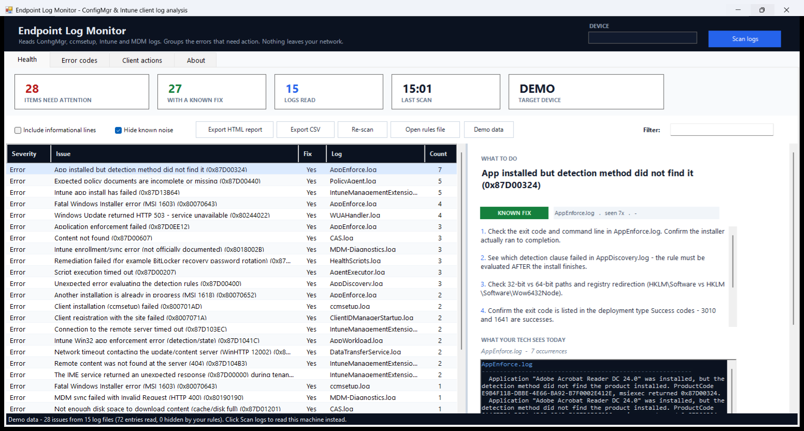
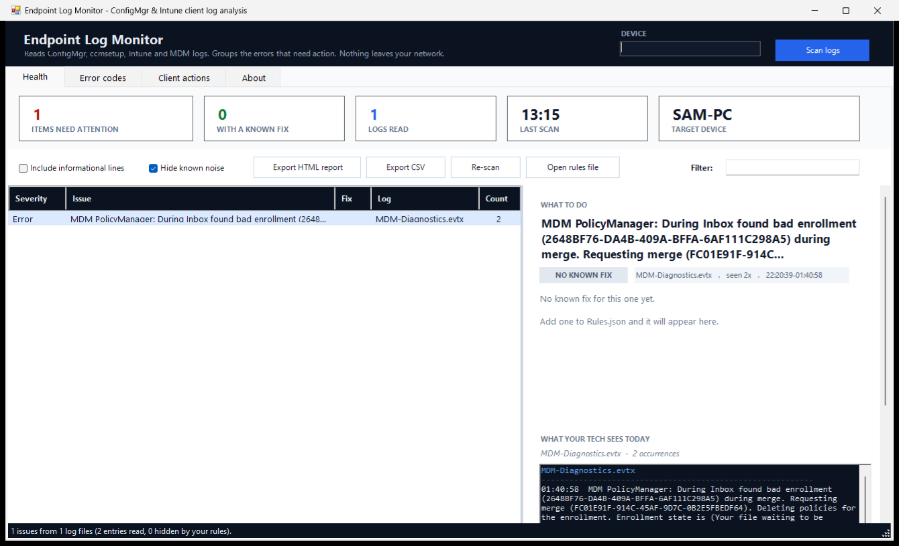

# Endpoint Log Monitor

A single-folder **PowerShell 5.1 + WinForms** desktop tool for Windows admins and endpoint techs.
It reads the ConfigMgr (SCCM), ccmsetup, Intune Management Extension and MDM client logs on a
machine, collapses the repeated errors into one row per real problem, attaches known
troubleshooting steps, decodes error codes and exports a ticket-ready report — all from one
window, with no agent, no server and no telemetry.



*Health tab with **Demo data** loaded: 28 grouped issues from 15 sample SCCM/Intune logs, 27 of
them matched to a known fix, with the selected issue's steps and raw log lines on the right.*

## Screenshots

| Health tab (demo data) | Health tab (real scan) |
| --- | --- |
|  |  |

## Why

Patches, apps, security baselines and compliance all reach a device through the ConfigMgr client
or the Intune Management Extension. When that agent is unhealthy nothing arrives, and the device
still looks fine in the console. The answer is buried in 150+ log files that nobody wants to open
one by one. This tool reads them for you and tells you what to do next.

## Features

- **Reads the real logs** — `C:\Windows\CCM\Logs`, `C:\Windows\ccmsetup\Logs`,
  `C:\ProgramData\Microsoft\IntuneManagementExtension\Logs` and the
  `DeviceManagement-Enterprise-Diagnostics-Provider` event log.
- **Three log formats** — CMTrace (`<![LOG[...]LOG]!>`), legacy SMS (`$$<Component><date>`) and
  plain text, with severity taken from the record type or guessed from the wording.
- **Grouping that survives change** — messages are normalised (GUIDs, timestamps, hex codes and
  long numbers become tokens) so the same problem lands on one row with a count, first/last seen
  and up to four real sample lines.
- **Known fixes next to the problem** — 91 fixes in `Rules.json`, matched by error code first and
  by regex second, each with numbered steps and a confidence level (`verified` / `community` /
  `unverified`).
- **Error-code decoder** — hex, signed and unsigned decimal and MSI/Win32 exit codes. Understands
  `0x87D00324 = -2016410844 = 2278556452`, the `0x8007xxxx` HRESULT_FROM_WIN32 family and small
  exit codes like `1618` / `3010`.
- **Noise control** — 22 built-in noise patterns filter routine WSUS / Group Policy chatter, and
  any row can be hidden team-wide from the right-click menu (the pattern is written to
  `Rules.json` and ignores volatile parts).
- **Remote devices** — type a computer name to read another PC over `admin$` / `C$`. Nothing is
  installed on the endpoint.
- **Client actions** — trigger the 10 ConfigMgr client cycles, restart `CcmExec` / `wuauserv`,
  clear `ccmcache` (with confirmation) and force an Intune/MDM sync, locally or remotely.
- **Exports** — self-contained HTML report (summary cards, issue table, full troubleshooting
  steps) and CSV; single issues copy to the clipboard as steps or as a CSV row.
- **Demo data** — one button writes 15 realistic sample SCCM/Intune logs and scans those, so the
  tool can be demonstrated on a machine with no ConfigMgr client installed.

## Requirements

- Windows 10/11 with Windows PowerShell 5.1 (`#Requires -Version 5.1`)
- .NET Framework WinForms (built into Windows)
- To scan *another* PC: administrative share access to it

No installation, no dependencies to download, nothing to run as a service.

## Quick start

```powershell
git clone https://github.com/kajalkumarshal-07/endpoint-log-monitor.git
cd endpoint-log-monitor
powershell -ExecutionPolicy Bypass -File .\EndpointLogMonitor.ps1
```

Optional parameters:

```powershell
# pre-fill the DEVICE box and scan that machine as soon as the window opens
.\EndpointLogMonitor.ps1 -ComputerName PC-042

# use a shared rules file instead of .\Rules.json
.\EndpointLogMonitor.ps1 -RulesPath "\\share\team-rules.json"
```

Then click **Scan logs** — or **Demo data** if this machine has no client logs.

## Using it

| Tab | What is on it |
| --- | --- |
| **Health** | Toolbar (info lines, noise, exports, re-scan, rules file, demo data, filter), five stat cards, the issues grid and the detail pane with WHAT TO DO, the numbered fix steps, sample log lines and a WHY IT MATTERS note. Right-click a row to copy it, hide it or look up its code. |
| **Error codes** | Paste any code — `0x87D00324`, `-2016410844`, `2278556452`, `1618` — and get every representation, the plain-English meaning, a confidence statement and the steps. |
| **Client actions** | The 10 ConfigMgr cycles (policy, app evaluation, update scan, inventory, heartbeat, location services, agent cleanup) plus service restarts, `ccmcache` clear and Intune sync, with a colour-coded console log. |
| **About** | Why it matters, what it reads, what it does. |

### How a scan works

```
resolve roots  ->  enumerate *.log / *.lo_  ->  parse (CMTrace | SMS | text)
     ->  keep warnings/errors (or everything if ticked)
     ->  drop hidden (yours) and noise (built-in) patterns
     ->  extract error codes  ->  normalise  ->  group
     ->  match a fix  ->  build rows  ->  sort (errors first, most frequent on top)
```

Groups are keyed on `log file | normalised message | known codes`, so changing GUIDs and
timestamps never splits one problem into many rows.

### Editing the rules

`Rules.json` is the shared knowledge base:

```json
{
  "version": 1,
  "fixes": [
    {
      "codes": ["0x87D00324", "-2016410844", "2278556452"],
      "title": "App installed but detection method did not find it",
      "logs": ["AppEnforce.log", "AppDiscovery.log"],
      "confidence": "verified",
      "steps": ["Check the exit code and command line in AppEnforce.log ..."]
    }
  ],
  "noise": ["(?i)^Waiting for (2 mins|30 secs) for (Group Policy|policy) to"],
  "hidden": []
}
```

`match` (a regex on the message) is an optional alternative to `codes` for problems that carry
no stable code. The file is only ever written when you choose **Hide this pattern** from the
right-click menu; your additions are never overwritten.

## Tests

Two headless suites live in the development workspace and are re-run after every change:

| Suite | Covers | Checks |
| --- | --- | --- |
| `elm-test.ps1` | rules index, code conversions, the three parsers, grouping/normalisation, fixes, HTML/CSV exports, demo generation and the demo scan | **96** |
| `elm-smoke.ps1` | builds the real UI in memory (with `ShowDialog` stripped), drives a real scan, a demo scan, selection, filtering, the decoder, client actions and exports | **57** |

## Repository layout

```
EndpointLogMonitor.ps1   entry point - run this; holds all window wiring
Rules.json               91 fixes, 22 noise patterns, 0 hidden patterns
Rules.lib.ps1            rules file handling + error-code decoding
LogReader.lib.ps1        parsing, scanning, grouping, row building
Export.lib.ps1           HTML and CSV report writers
Actions.lib.ps1          ConfigMgr cycles, services, cache, Intune sync
Demo.lib.ps1             sample log generator behind the Demo data button
Ui.Build.ps1             window construction, layout and anchors
GUIDE.txt                full functionality guide (600 lines)
docs/                    screenshots used in this README
```

## Notes

- Nothing leaves your network: the tool reads log files and one event log, and writes only
  `Rules.json` (when you hide a pattern) plus the report files you export.
- Logs are opened with shared read/write access, so a live log still opens; files are never
  modified.
- Safety limits: 400,000 entries and 20,000 groups per scan, 1,500 MDM events.
- The only destructive action, **Clear ccmcache**, asks for confirmation first.
- Minimum window size 1320 × 760; the window sizes itself to your working area on launch.

Full walkthrough: [`GUIDE.txt`](GUIDE.txt).

Microsoft, Configuration Manager and Intune are trademarks of the Microsoft group of companies.
This tool is independent and is not affiliated with or endorsed by Microsoft.
